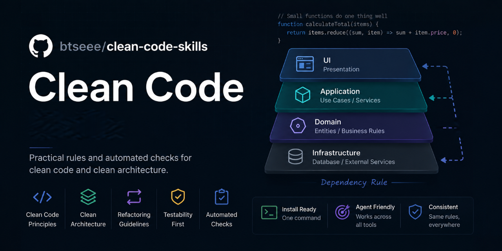

<p align="center">
  
</p>

# Clean Code Skills

[](https://github.com/btseee/clean-code-skills/releases/latest)
[](https://github.com/btseee/clean-code-skills/actions/workflows/ci.yml)
[](./LICENSE)

Clean-code **and clean-architecture** discipline for AI coding agents — Claude Code, Claude Desktop / claude.ai, Codex CLI, opencode, Jules, Gemini CLI, GitHub Copilot, Cursor, Windsurf, Cline, and any tool that reads `AGENTS.md` or Agent Skills.

## Purpose

AI agents rarely fail at syntax. They fail by putting code in the wrong place, duplicating knowledge, mixing responsibilities, inventing APIs, wiring the shortest path between two points, and claiming success without running anything. They also forget everything between sessions.

This package addresses those failures specifically. One language-agnostic `clean-code` skill is the source of truth; thin adapters carry an identical, versioned rules block into every agent's instruction file, so all your tools enforce the same behavior instead of each having its own opinion.

Two things make it different from a style guide:

- **It covers both scales.** Naming and function size matter, but so does which direction a dependency crosses a boundary — and only one of those gets worse over years.
- **It assumes the agent has no memory of your project.** Durable context lives on disk in a `.clean/` directory, so a cold session reconstructs the stack, the declared layering, and past decisions instead of guessing.

## Capabilities

### Code level

Meaningful names, small focused functions, honest comments, formatting and ordering, data versus objects, error handling, boundaries, tests, concurrency, security, performance — plus correct file and code placement, one job per unit, and the full smell catalogue with stable citable IDs (`C`, `E`, `F`, `G1`–`G36`, `J`, `N`, `T`).

### Architecture level

The Dependency Rule, level as distance from I/O, the four circles and what may cross them, boundary costs and the three partial-boundary forms, SOLID stated as dependency rules, component cohesion and coupling with the instability / abstractness / distance metrics, policy versus detail, the Humble Object, the four packaging strategies, and the three decoupling modes.

### Named vocabulary, on purpose

The Three Laws of TDD, F.I.R.S.T., BUILD-OPERATE-CHECK, DRY, the Law of Demeter and train wrecks, the Stepdown Rule, data/object anti-symmetry, the Special Case pattern, LeBlanc's law, Producer-Consumer / Readers-Writers / Dining Philosophers, REP / CCP / CRP / ADP / SDP / SAP. Precision is the point: an agent that can name F.I.R.S.T. can apply it and cite it, and a reviewer can check the citation.

### What an agent using this does

1. Load project context from `.clean/` and the project's own instruction files before deciding anything.
2. Frame the change: behavior, assumptions, smallest scope, and the check that proves it.
3. Read local context and search for existing implementations before writing anything new.
4. Put code and files where the project's conventions say they belong — and wire new files in completely.
5. Keep one job per unit; route behavior to the module that owns the responsibility.
6. Point every new dependency inward, and keep details — database, web, framework, ORM types — out of business rules.
7. Edit surgically; never regenerate whole files when a targeted edit will do.
8. Verify with real commands and report honestly what ran and what did not.

### What ships

| Piece | Path | Purpose |
| --- | --- | --- |
| Agent skill (canonical) | `skills/clean-code/SKILL.md` | Router and non-negotiables, kept inside the spec's 500-line / 5k-token budget |
| Canon index | `references/canon.md` | Every named rule with its operational meaning — the fastest way in when you know the name |
| Architecture rules | `references/architecture.md` | Dependency rule, SOLID, component principles, boundaries, systems, packaging, testability, decoupling modes |
| Architecture map | `references/architecture-map.md` | Routing table: the question you face, and the rule that answers it |
| Code principles | `references/principles.md` | Naming, functions, formatting, errors, data, security, performance in full |
| Test discipline | `references/tests.md` | Three Laws of TDD, F.I.R.S.T., BUILD-OPERATE-CHECK, and the test failure modes |
| Concurrency | `references/concurrency.md` | Execution models, the four deadlock conditions, and seven tactics that catch a race |
| Chapter and smell map | `references/chapter-map.md` | Per-chapter coverage, the smell IDs, and the cross-reference table |
| Smell triage | `references/smell-triage.md` | Every smell with its usual response and the order to fix them in |
| Workflows | `references/session-protocol.md`, `new-project.md`, `project-refactor.md`, `audit-report.md` | One per situation: a normal session, a greenfield start, a cleanup campaign, a report |
| Review checklist | `references/review-checklist.md` | Finding-first review scan including placement and responsibility |
| Framework map | `references/framework-map.md` | Per-language idioms and file-placement conventions |
| Worked examples | `references/examples.md` | Before-and-after cases in Python, TypeScript, Go and SQL, plus output templates |
| Memory protocol | `references/memory-protocol.md` | What to persist in `.clean/` so a memoryless session can resume |
| Host matrix | `references/host-matrix.md` | Per-host skill paths, capabilities, and portable substitutes |
| Tools | `skills/clean-code/scripts/*.py` | `detect_stack.py`, `scan_repo.py`, `check_boundaries.py` |
| Templates and hooks | `skills/clean-code/assets/` | `.clean/` templates, a portable git pre-commit hook, Claude Code hook settings |
| Managed rules block | `templates/agent-block.md` | The single text inserted into every agent's instruction file |
| Adapters | `CLAUDE.md`, `AGENTS.md`, `GEMINI.md`, `.github/`, `.cursor/`, `.windsurf/`, `.clinerules/` | Per-client carriers of the same block |
| Manifests | `.claude-plugin/`, `.codex-plugin/`, `gemini-extension.json` | Native packaging for Claude Code, Codex-style registries, Gemini CLI |
| Installers | `scripts/install.{sh,ps1}`, `scripts/remote-install.{sh,ps1}` | Local and no-clone install, update, global mode, uninstall |
| Validators and CI | `scripts/validate.{sh,ps1}`, `.github/workflows/` | Repo integrity, block and version sync, installer behavior on Linux and Windows |

`references/` paths above are relative to `skills/clean-code/`.

## Requirements

**The skill itself requires nothing.** It is Markdown that the agent reads, and every workflow works with zero tooling — each step that names a script also names its manual equivalent.

Everything below is optional, and only for the piece it enables:

| You need | To |
| --- | --- |
| bash, or PowerShell 7+ | run the installer locally |
| `curl` and `tar`, or PowerShell `irm` | use the no-clone remote installer |
| Python 3.8+ | run the three optional scripts (standard library only, no network) |
| `git` | use the portable pre-commit hook |
| Node / `npx` | contributors only: run markdownlint |

Host support for hooks, slash commands, and permissions varies and is **never required for correctness** — see `references/host-matrix.md`.

## Installation

### Quick install, no clone

Run inside your project. Linux, macOS, Git Bash:

```bash
curl -fsSL https://raw.githubusercontent.com/btseee/clean-code-skills/main/scripts/remote-install.sh | bash -s -- all
```

Windows PowerShell:

```powershell
& ([scriptblock]::Create((irm https://raw.githubusercontent.com/btseee/clean-code-skills/main/scripts/remote-install.ps1))) all
```

Replace `all` with just the agents you use: `claude cursor copilot`. Both commands fetch the latest release (falling back to `main`) and run the packaged installer against the current directory.

### Cross-host skills CLI

If you want the skill alone, without adapter blocks. It installs into `.agents/skills/` and symlinks into each agent directory it detects:

```bash
npx skills add btseee/clean-code-skills --skill clean-code
```

### Native, per client

| Client | Native path |
| --- | --- |
| Claude Code | `/plugin marketplace add btseee/clean-code-skills`, then `/plugin install clean-code-skills@clean-code-skills` — updates arrive through the marketplace |
| Claude Desktop / claude.ai | Download `clean-code.zip` from the [latest release](https://github.com/btseee/clean-code-skills/releases/latest), then Settings → Capabilities → Skills → upload. Works for the Skills API too |
| Gemini CLI | `gemini extensions install https://github.com/btseee/clean-code-skills`, update with `gemini extensions update clean-code-skills` |
| Codex CLI, opencode, Jules, Amp | Quick-install with the `agents` profile, which writes the `AGENTS.md` block |
| Cursor / Windsurf / Cline | Quick-install with the `cursor`, `windsurf`, or `cline` profile |
| GitHub Copilot | Quick-install with the `copilot` profile — instructions plus `.github/skills/` |
| Anything else | Paste `templates/agent-block.md` into whatever instruction file the tool reads, and copy `skills/clean-code/` next to it |

### Once for every project

Global mode writes into the home-directory config that CLI agents read everywhere:

```bash
bash scripts/install.sh --global all      # ~/.claude, ~/.codex, ~/.config/opencode, ~/.gemini
```

```powershell
pwsh scripts/install.ps1 -Global all
```

Editor rules (Cursor, Windsurf, Cline, Copilot) are project-scoped by design and are skipped in global mode.

## Usage

Once installed, agents pick the skill up on their own — the `description` is what every host matches against. You can also invoke it by name, or ask for one of the four workflows.

| Workflow | Ask for it when |
| --- | --- |
| **Session** | default for any coding task in an existing project |
| **Onboard** | you want an existing project assessed, cleaned up, or refactored |
| **Bootstrap** | you are starting a project or a major new module |
| **Audit** | you want a report or health check with no code changed |

Cleanup of a whole project is a distinct mode: baseline verification first, small behavior-preserving batches, a written ledger, and a checkpoint per batch (`references/project-refactor.md`). It never starts implicitly.

### Optional enforcement

Instructions are guidance, and a model can skip a step. Where determinism matters, let code do the checking:

```bash
python skills/clean-code/scripts/detect_stack.py --write       # cache project context
cp skills/clean-code/assets/templates/architecture.md .clean/  # declare your layers
python skills/clean-code/scripts/check_boundaries.py           # fail on outward dependencies
cp skills/clean-code/assets/hooks/pre-commit .git/hooks/       # enforce it on every commit
```

The pre-commit hook is the only enforcement that behaves identically on every host, because it needs no agent support at all.

### Updating

Same one-liner you installed with, plus `--detect`, which refreshes exactly the pieces already present and leaves everything else alone:

```bash
curl -fsSL https://raw.githubusercontent.com/btseee/clean-code-skills/main/scripts/remote-install.sh | bash -s -- --detect
```

Native channels update natively: Claude Code through the plugin marketplace, Gemini CLI with `gemini extensions update`, Claude Desktop by uploading the new release zip.

The rules block carries its version in its begin marker, so you can always see what a project is running. Agents are told **not** to fetch and execute remote update scripts on their own initiative — updating is your call.

How installs and updates behave:

- **Shared files** (`CLAUDE.md`, `AGENTS.md`, `GEMINI.md`, `.github/copilot-instructions.md`) get a managed block between `<!-- clean-code-skills:begin -->` markers. Everything outside the markers is preserved; updates replace only the block.
- **Dedicated files and skill folders** (`.cursor/rules/clean-code.mdc`, `.windsurf/`, `.clinerules/`, `skills/clean-code/`, `.claude/skills/clean-code/`, `.github/skills/clean-code/`) are owned by this package and replaced on each run. A file that exists but was not created by this package is skipped unless you pass `--force`.
- `--detect` inspects the target and operates only on profiles already installed — the right mode for updates.

### Uninstalling

```bash
bash scripts/install.sh --target /path/to/project --uninstall all
```

Removes managed blocks while keeping your own content, and deletes package-owned files and folders. Works with `--global` too.

### Validating the package

For contributors, and after any change to the rules block:

```bash
bash scripts/validate.sh
```

```powershell
pwsh scripts/validate.ps1
```

Both check required files, front matter, version sync across every stamped location, managed-block consistency across all eight adapters, JSON and script syntax, the `SKILL.md` size budget, that the bundled Python imports nothing outside the standard library, that no shipped file carries an absolute machine path, that committed content is LF, and full installer behavior — fresh install, content-preserving merge, idempotent re-install, `--detect`, global mode, and clean uninstall. CI runs both plus markdownlint on every push and pull request.

## Configuration

### Project state: the `.clean/` directory

The mechanism that lets a memoryless session resume. Templates are in `skills/clean-code/assets/templates/`, and `.clean/` is gitignored by default — `architecture.md` is the one file usually worth committing, because it is a shared decision that drives a check in CI.

| File | Holds | Written by |
| --- | --- | --- |
| `context.json` | detected stack, frameworks, test command, layout | `detect_stack.py --write`, or by hand |
| `architecture.md` | declared layers and allowed dependencies | you, with the agent's help |
| `decisions.md` | decisions and their reasoning, append-only | any session that made a real choice |
| `ledger.md` | state of a cleanup campaign in progress | campaign mode only |

Declare layers innermost first, in a fenced block the tools can read:

````markdown
```clean-architecture
layer domain         = src/domain/**
layer application    = src/application/**
layer adapter        = src/adapter/**
layer infrastructure = src/infrastructure/**

# Optional. The default is inward-only, so most projects need none.
# allow infrastructure -> domain
```
````

The default rule is the Dependency Rule itself: a layer may depend on itself and on any layer declared before it, and on nothing declared after it.

### Environment variables

| Variable | Effect |
| --- | --- |
| `CLEAN_CODE_REF` | Pin the remote installer to a version, e.g. `CLEAN_CODE_REF=v3.0.0` |
| `CLEAN_CODE_HOME` | Override the home directory global mode installs into |
| `CLEAN_CODE_HOOK=off` | Disable the pre-commit hook for one commit |
| `PYTHON_BIN` | Point the hook at a specific interpreter |

### Install profiles

`claude`, `agents`, `codex`, `opencode`, `jules`, `gemini`, `cursor`, `copilot`, `windsurf`, `cline`, `skill`, `all`. Pass any combination; `--detect` picks the ones already present.

### Hooks

`skills/clean-code/assets/hooks/pre-commit` is portable and needs no host support. `claude-settings.json` adds a session-start context print and a post-edit boundary check for Claude Code — merge it into `.claude/settings.json` rather than replacing the file. Neither hook blocks an edit; only the pre-commit hook blocks a commit, and only on a dependency-rule violation.

## Examples

### Declare an architecture and enforce it

```console
$ python skills/clean-code/scripts/check_boundaries.py
Dependency Rule check

  Layers (innermost first): domain -> application -> adapter -> infrastructure
  Files matched           : domain (5), application (149), adapter (8), infrastructure (12)
  Cross-layer imports     : 304

  FAIL: 1 dependency-rule violation(s).

  src/domain/order.py:3: domain -> infrastructure (imports app.infrastructure.db)

  Each line above is an outward dependency: an inner layer that knows
  about an outer one. Fix by inverting it -- declare the interface in
  the inner layer and implement it in the outer one -- not by widening
  the rules.
```

### See what a cold session would find

```console
$ python skills/clean-code/scripts/detect_stack.py
Project context (inferred; confirm before relying on it)

  Primary language : C#
  Languages        : C# (509), SQL (20), Python (5), Shell (2)
  Ecosystems       : .NET solution, C#/.NET
  Frameworks       : ASP.NET Core
  Test runners     : MSTest
  Verify with      : dotnet test
```

### Ask for a report instead of changes

> Audit this project for clean code and architecture.

Produces a findings-first report with a verdict, the recorded test baseline, findings by severity with file and line, an architecture assessment, metrics, and a recommended sequence — and changes no code. See `references/audit-report.md`.

### Report completion honestly

The difference the skill insists on:

> ~~This should work now.~~
>
> I ran `npm test -- email-validator` and the empty-email regression test passes. I did not run the full suite.

More before-and-after cases, in Python, TypeScript, Go and SQL, are in `references/examples.md`.

## Constraints

Worth knowing before you adopt it.

- **`SKILL.md` is budget-locked** to 500 lines and roughly 5,000 tokens, because hosts load the whole body on activation. Depth lives in `references/`, which load on demand. Both validators enforce the ceiling.
- **Only five frontmatter fields are portable** — `name`, `description`, `license`, `compatibility`, `metadata`. `allowed-tools` is experimental and is never relied on for correctness.
- **Hooks, slash commands, permissions, and memory are not part of the Agent Skills standard.** They are host-specific, so they live in `assets/` and `host-matrix.md` with a portable substitute for each.
- **The bundled scripts are standard library only, with no network access.** They read your files and write only to `.clean/`. A validator check rejects any third-party import.
- **Script output is evidence, not a verdict.** `scan_repo.py` measures; deciding what matters is the agent's job.
- **The Boy Scout Rule is deliberately narrowed.** Agents clean the lines a task already touches and report the rest, because an agent applying the rule broadly produces unreviewable diffs. The departure from the source is documented in `references/chapter-map.md` rather than left implicit.
- **No cross-host smoke test has been run.** Portability rests on conformance to the Agent Skills specification and the per-host audit in `host-matrix.md`, not on observed behavior in Copilot CLI, Codex, Cursor or Gemini CLI.
- **No book text is reproduced here.** Principle names and their canonical one-line formulations are the established vocabulary of the field; all guidance around them is written for this project. Copyrighted study material used while writing it is gitignored and must never be committed or redistributed with this repo. If you clone this to study from, keep it that way.

### Releases and versioning

`VERSION` is the single source. To release: update `VERSION`, run `bash scripts/sync.sh` to propagate it everywhere, validate, then tag.

```bash
git tag "v$(cat VERSION)"
git push origin main --tags
```

The release workflow validates, checks the tag against `VERSION` — they must match exactly — and publishes a GitHub release with `clean-code.zip`, the skill packaged for Claude Desktop / claude.ai / Skills API upload. See [CHANGELOG.md](./CHANGELOG.md) and [CONTRIBUTING.md](./CONTRIBUTING.md).

## License

MIT. See [LICENSE](./LICENSE).
