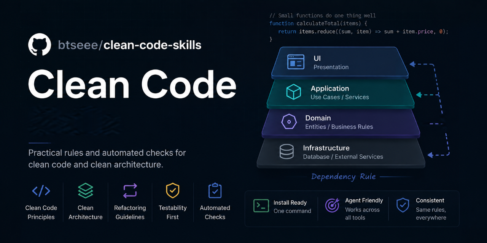

<p align="center">
  
</p>

# Clean Code Skills

[](https://github.com/btseee/clean-code-skills/releases/latest)
[](https://github.com/btseee/clean-code-skills/actions/workflows/ci.yml)
[](./LICENSE)

Clean code and clean architecture for AI coding agents: one skill, rule packs for 19 languages and
21 frameworks, and a structure map that shows where every function and class lives and whether it
belongs there. Works with Claude Code, Codex, Cursor, GitHub Copilot, Gemini CLI, Windsurf, Cline,
and any tool that reads Agent Skills or `AGENTS.md`.

## Why

Coding agents rarely fail at syntax. They fail by:

- **putting code in the wrong place** — a middleware inside an auth service, a helper at the
  repository root;
- **duplicating knowledge and mixing responsibilities** until one file does five jobs;
- **forgetting the project between sessions** and guessing its conventions all over again.

This skill makes an agent load the project's context first, apply the rules of *Clean Code* and
*Clean Architecture* for its exact stack, and prove what it claims.

## Install

Run inside your project. Linux, macOS, Git Bash:

```bash
curl -fsSL https://raw.githubusercontent.com/btseee/clean-code-skills/main/scripts/remote-install.sh | bash -s -- all
```

Windows PowerShell:

```powershell
& ([scriptblock]::Create((irm https://raw.githubusercontent.com/btseee/clean-code-skills/main/scripts/remote-install.ps1))) all
```

Replace `all` with the agents you use, such as `claude cursor copilot`. As a Claude Code plugin:
`/plugin marketplace add btseee/clean-code-skills`, then
`/plugin install clean-code-skills@clean-code-skills`. The skill alone:
`npx skills add btseee/clean-code-skills --skill clean-code`. Every host, global installs, updating,
and uninstalling: [docs/install.md](docs/install.md).

## Use

Agents pick the skill up by themselves when you ask for coding work. Four commands cover the rest —
`/clean-code <command>` in Claude Code, or plain language anywhere:

| Command | What happens |
| --- | --- |
| `init` | Detects your stack and its packs, asks a few questions, and maps the structure into `.clean/`. Run it once. |
| `audit` | Reviews every file, fills `.clean/`, and reports findings first. Changes no code. |
| `clean-up` | Works through the audit's findings in small, verified batches. |
| `new-project <description>` | Designs a new project before any code is written. |

Then just ask:

```text
Add rate limiting to the login endpoint. Keep the change surgical and tell me what you did not run.

Where does this currency formatter belong? Follow the project's conventions.

Review my diff. Findings first, with smell IDs.
```

## What You Get

- **Rules at both scales.** Names, functions, errors, tests, one job per unit, and file placement —
  plus the Dependency Rule, SOLID, and the component principles, enforced strictly once you declare
  layers.
- **Packs for your stack.** Languages: TypeScript, JavaScript, Python, Java, C#, C++, C, PHP, Go,
  Rust, Swift, Kotlin, Ruby, Dart, Scala, R, Objective-C, Shell, PowerShell. Frameworks: React,
  Next.js, Vue and Nuxt, Angular, Svelte and SvelteKit, Django, Flask, FastAPI, Express, NestJS,
  Spring, ASP.NET Core, Laravel, Symfony, Rails, Gin and Beego, Strapi, Flutter, SwiftUI and UIKit,
  Jetpack Compose, Ktor. An agent loads only the packs its project uses.
- **A structure map.** Every file's functions and classes, its role and purpose, and what is
  misplaced, mixed, duplicated, named two ways, or caught in a dependency cycle — in one file.
- **Memory between sessions.** `.clean/` keeps the stack, the declared layers, past decisions, and
  cleanup progress, so a new session resumes instead of guessing.
- **A small footprint.** The always-loaded rules are under 1,200 tokens, the skill about 2,000, and
  each pack under 2,000.

## The Structure Map

```console
$ python .claude/skills/clean-code/scripts/map_structure.py --path src/services
  Findings  : misplaced 1, mixed 0, duplicates 0, name clashes 0, synonyms 1, cycles 0 (under src/services)

  Misplaced
    src/services/auth.ts:7 authMiddleware is middleware in a service file; move it to src/middleware/.

  Synonyms
    user (retrieve): fetch x1 (src/services/users.ts:5), get x1 (src/services/users.ts:1)

  Files under src/services
    src/services/auth.ts [service] AuthService, authMiddleware !
    src/services/users.ts [service] getUser, fetchUser
```

With `--write` it saves `.clean/structure.md`, ordered so a partial read gets the findings first,
then the folder tree, the component metrics and a dependency graph, and one greppable row per file.

## Optional Enforcement

```bash
python .claude/skills/clean-code/scripts/detect_stack.py --write    # stack and packs into .clean/
python .claude/skills/clean-code/scripts/map_structure.py --write   # the structure map
python .claude/skills/clean-code/scripts/check_boundaries.py        # fail on wrong-way dependencies
cp .claude/skills/clean-code/assets/hooks/pre-commit .git/hooks/    # check on every commit
```

The scripts need only Python 3.8 or later, read your files, write only to `.clean/`, and never use
the network. Declaring layers and roles, and the hooks: [docs/configuration.md](docs/configuration.md).

## Documentation

- [docs/install.md](docs/install.md) — every host, global installs, updating, uninstalling
- [docs/configuration.md](docs/configuration.md) — the `.clean/` files, layers, roles, hooks, constraints
- [skills/clean-code/SKILL.md](skills/clean-code/SKILL.md) — what the agent reads
- [CONTRIBUTING.md](CONTRIBUTING.md) — writing a pack, validating, releasing
- [CHANGELOG.md](CHANGELOG.md) — what changed in each version

No book text is reproduced here: principle names are the field's vocabulary, and everything around
them is original.

## License

MIT. See [LICENSE](./LICENSE).
